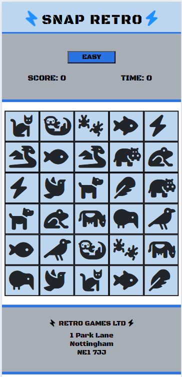
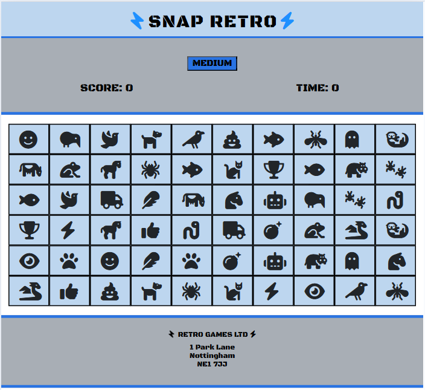
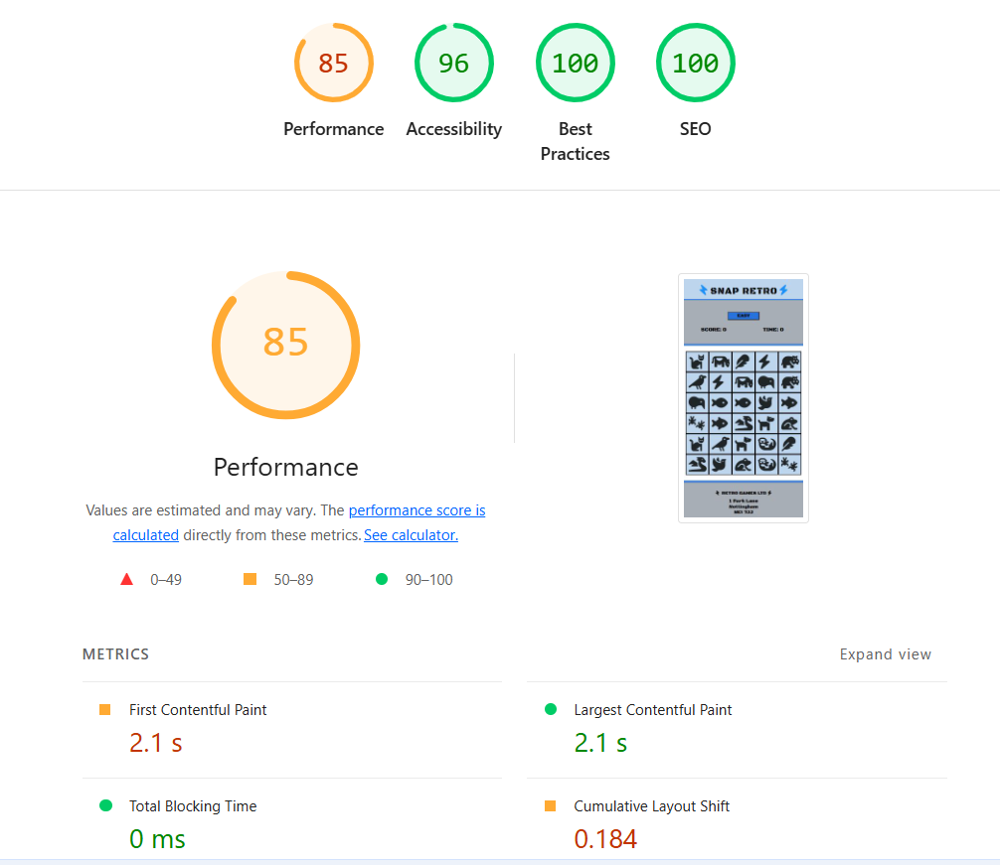

## SNAP RETRO 

### By Gary Hird
### 9th of August 2025 (MileStone Project 2)

---

## Introduction 

After consideration i have chosen to build a interactive children's memory game for my Milestone 2 project.
I believe a 'Game project' would be a interesting new coding challenge, different from my previous webpage projects.

I would like to recreate the old playing card game of snap, 
where two players would take turns placing hobby image cards down, until two identical cards placed on the table matched.
At this point the player with the quickest reactionary speed would declare 'Snap'

However, i will be building a single player game as intended for sole use on a users personal mobile device. 

The necessary coding involved in my intended interactive project, offers plenty of opportunity to demonstrate 
good working knowledge and practical implementation of using HTML, CSS & JavaScript to achieve a pass standard. 

Although i have not previously built a similar project, 
i'm confident with my current ability and with aid of external resources it is achievable. 

## Design 

I am planning on having a very simple but effective design for the game with a 'retro' theme which i believe will work well, 
while keeping the design simple and easy too produce allowing me to focus on the functionality.

In terms of the physical display and only if not required for the later project marking criteria.
i would like have a single page project without any links or navigation. presenting itself similar to a downloadable 'Mobile App Game'

For future personal projects, I may keep practising building games as i can challenge myself by creating ever more complicated games,
This is why starting with a 'Retro Theme' is in my opinion the best place to begin. 
As Games have progressed and the technology has improved since the 1990s, recreating games like 'Frogger', 'Pacman' and 'Tetrus'
would give me better understanding and a firmer foundation.

## Colors 

Starting with one of my favorite colors 'Electric Blue' precisely using Dev Tools i have selected #2973e2, 
complimenting this colour, i have chosen a lighter shade of blue and also a light grey. 

During this project i found the white background to be too bright, 
so using 'Dev Tools' i have found a slightly darker shade of white

#2973e2       Electric Blue / dodgerblue
#bdd6ef       Light Blue
#A8AEC1       Light Grey
#dce1e4       Not-bright White 
#fd7e14       Orange 

## Logo 

I have created the logo from plane text, the capitalized wording of 'SNAP RETRO'
i have imported and used a font style called 'black-ops-one' From Google Fonts. 
This particular font looked the most 'Retro'

On either side of this font, i have used a 'Lightning Bolt Icon' from 'Font Awesome library'
This Icon was also used on my last Milestone Project 'POWER HOUSE' So i have included it for the sentiment. 
The icon on the left has been transformed, by rotation of 180 degrees on the Y axis. 

As seen below

## Images 

Mobile display

Tablet display

## Testing

## Lighthouse

Completed Lighthouse 1st Assessment

Performance 85
Accessability 98
Best Practices 100
SEO 100

## Bugs

## Used Recourses  

- Bootstrap version 5.2.3 
- Font Awesome 
- Google Fonts 
- Font-family: Black-ops

## Additional Recourses 

- W3Schools website
- W3C validator.w3.org 
- W3C CSS Vallation

### Books
- HTML & CSS by John Duckett
- JavaScript & JQuery by John Duckett
- CSS Mastery by Andy Budd
- CSS Secrets by Lea Verou 
- Bootstrap Reference Guide by Jacob Lett 
- Mastering Bootstrap 5 by Frahaan Hussain 

